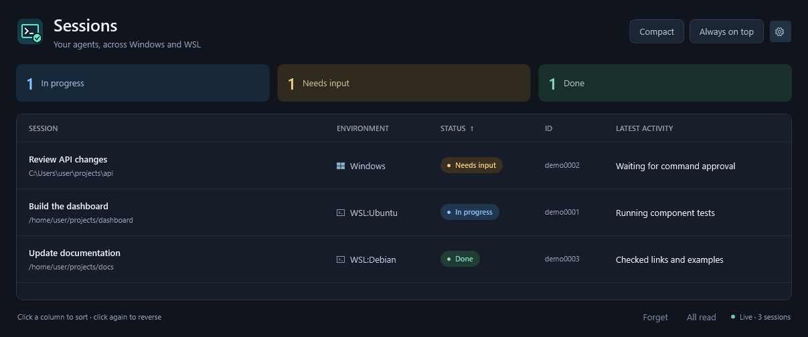
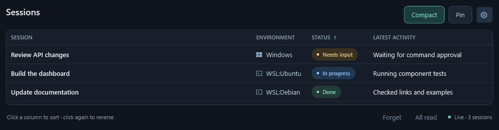

# Copilot Agent Notify

**See which Copilot sessions are working, waiting for you, or finished.**

**Copilot Sessions** is a lightweight Windows desktop gadget for monitoring
GitHub Copilot CLI sessions across native Windows and running WSL distributions.
Keep it beside your terminals, get notified when input is needed, and track
unread completions without checking every session.

The gadget works independently: **no Copilot plugin or Zellij installation is
required**. This repository also includes optional notification hooks and
terminal activity indicators.

An independent community project, not an official GitHub or Microsoft product.

## What it does

- **One view for Windows and WSL.** Session titles, environments, working
  directories, and status in a sortable table.
- **Notifications that identify the session.** Alerts for permission/input
  requests and observed completions.
- **Unread completion tracking.** A `Done · New` label and taskbar badge, with
  per-session or bulk marking as read.
- **A compact, pinnable window.** Comfortable and compact layouts, always-on-top,
  font controls, and solid, translucent, or Acrylic appearance.
- **Local dismissal.** Forget a session until new activity without stopping
  Copilot or deleting its history.
- **Latest activity.** With the optional SDK bridge, see the main agent's latest
  reported intent or tool activity in a separate column. Hide it with **Appearance > Show latest
  activity**; the choice persists across restarts and layouts.

## Screenshots

The examples below use synthetic sessions, paths, IDs, and activity descriptions.

**Comfortable layout**



**Compact layout, widened to show activity**



## Quick start: Windows gadget

### Requirements

| Component | Required for |
| --- | --- |
| Windows with .NET Framework 4.8 and WPF | Running the desktop gadget |
| Native Windows Python 3.9+ | Reading Windows session activity |
| .NET Framework MSBuild/C# tools | Building the gadget from source |
| Git | Cloning and updating this repository |
| WSL with `python3` 3.9+ in each monitored distribution | Optional WSL monitoring |

No third-party Python packages, browser runtime, or modern .NET SDK are needed.
The desktop UI runs on Windows; WSL supplies session data, not a separate UI.

### Build and install

Use **Windows PowerShell** from an approved local Windows checkout:

```powershell
git clone https://github.com/yuyue9284/copilot-agent-notify.git
cd copilot-agent-notify
.\windows-helper\build-gadget.ps1
.\windows-helper\install-gadget.ps1
```

Open **Copilot Sessions** from your desktop or Start Menu. Start a Copilot CLI
session on Windows or in WSL; the gadget discovers live sessions automatically.
It does not start stopped WSL distributions.

The installer copies the application to
`%LOCALAPPDATA%\CopilotAgentNotify\gadget` and creates shortcuts. It does **not**
enable automatic startup or install the optional Copilot plugin.

If Python discovery fails, supply its absolute Windows path:

```powershell
.\windows-helper\install-gadget.ps1 -Python C:\Tools\Python\python.exe
```

To try the built gadget without installing shortcuts, run `scripts\gadget.cmd`.
Keep the complete build output together; the executable needs its adjacent
configuration, collector files, and notification helper.

> If PowerShell blocks a script, use an approved checkout location or follow
> your administrator's guidance. Do not bypass execution policy. Launching
> `gadget.cmd` does not replace the build step.

## Understanding session status

| Status | Meaning |
| --- | --- |
| **In progress** | The main agent or a background agent is working, or a background-completion grace period is pending |
| **Needs input** | A permission or input request is waiting |
| **Done** | No tracked work remains; the Copilot session is still open |
| **Loading** | Session history is being read, or the SDK bridge is initializing during startup/session switching |
| **Unknown** | Session activity cannot be read reliably; check the displayed error |

**Done means idle, not successful.** The gadget does not judge whether code,
commands, or the requested task succeeded. There is no inactivity timeout that
marks long-running work as finished.

When the last background agent finishes while the main agent is idle, the
gadget holds **In progress** for a **10-second grace period** before displaying
**Done** and notifying you. Resumed work cancels the pending completion. This
reduces premature alerts while the main agent processes background results;
it is a timing heuristic, not a guarantee that work cannot resume later.
Main-agent completion and input requests do not receive this extra delay.

Status normally refreshes about every two seconds; running WSL distributions
are discovered about every ten seconds. Large session histories may take
several refreshes to load. Activity that starts and ends entirely between polls
may not be observed.

Status selection is automatic: sessions use transcript tracking, supplemented
by structured background-shell status when the optional
[SDK bridge prototype](docs/sdk-bridge.md) is running. No backend choice is
needed in the UI. Advanced troubleshooting can set `"status_backend": "legacy"`
in `~/.copilot/copilot-agent-notify.json` (or under `COPILOT_HOME`) for the
affected OS user. Preserve other settings when editing this file.
The bridge is not installed automatically; without it, a background shell that
outlives its tool invocation may still be missed.

## Everyday controls

| Control | Use |
| --- | --- |
| **Compact** | Switch to a smaller window with shorter rows |
| **Always on top / Pin** | Keep the gadget above other windows |
| **Appearance** gear | Choose appearance, font, size, opacity, and desktop notifications |
| Column headers | Sort sessions; click again to reverse |
| Select a row | View its details and mark its completion read |
| **Mark all read** | Clear unread completion badges |
| **Forget** | Hide the selected session until new conversation activity |

Unread completions are tracked only while the gadget is open. Sessions already
done at startup do not generate retroactive completion notifications or badges.
Selecting an already-selected row, or pressing Enter or Space on it, also marks
it read. Merely focusing the window does not.

Forgotten sessions stay hidden across restarts until new activity is recorded.
Forgetting does not stop an agent, delete a transcript, or affect other sessions.
It is unavailable while a session is Loading or Unknown.

Acrylic availability depends on Windows version, session, and system settings.
Auto uses translucency when Acrylic is unavailable or in a remote session.
High contrast or disabled Windows transparency takes precedence. Appearance
choices do not change your Windows settings.

## WSL and saved settings

By default, the gadget monitors the signed-in Windows user's Copilot sessions
and the default user's sessions in every running WSL distribution.
To restrict WSL monitoring, create
`%LOCALAPPDATA%\CopilotAgentNotify\gadget.json`:

```json
{
  "wsl_distros": ["Ubuntu"]
}
```

Names are case-insensitive. Use `[]` for Windows-only monitoring, or `null` for
all running distributions. Restart the gadget after editing this file.
Windows monitoring remains enabled.

| File under `%LOCALAPPDATA%\CopilotAgentNotify` | Purpose |
| --- | --- |
| `gadget.json` | WSL distribution selection |
| `gadget-ui.json` | Layout, appearance, font, and notification preferences |
| `gadget-forgotten.json` | Dismissed sessions and activity fingerprints |
| `gadget-owners\` | Local process-ownership cache |

The default session directory is `~/.copilot` for each monitored OS user.
`COPILOT_HOME` can override it when set in the collector's environment; the WSL
collector does not load shell-profile-only variables. Other users' sessions
and unconfigured custom homes are outside the discovery scope.

## Privacy and limitations

The gadget reads local session transcripts and process metadata to infer
activity. It does not modify transcripts, run Copilot tasks, or upload session
data. There is no gadget telemetry, HTTP server, or network service.
Windows and WSL collectors communicate through local process pipes.

**Session titles, IDs, and working-directory paths appear in the window and
notifications.** Local caches contain identifiers and activity fingerprints,
not copied prompt or tool-result text. The optional SDK bridge also stores the
latest main-agent intent or tool activity locally (up to 240 characters), which may contain
sensitive task details. Hiding the column does not disable this collection.
Diagnostic snapshots also contain this activity text when available and session
metadata. Review and redact screenshots, snapshots, and logs before sharing them
in an issue or anywhere public.

Status uses transcript inference and, optionally, the experimental SDK shell
task registry; it is not a guaranteed task-completion signal.
Future Copilot CLI changes may require compatibility updates. Closing the
gadget stops its collectors, not your Copilot sessions.

## Troubleshooting

| Symptom | Check |
| --- | --- |
| Gadget executable is missing | Run `build-gadget.ps1`; normal launch does not compile it |
| Python cannot be found | Install native Windows Python 3.9+ or specify `-Python` during installation |
| WSL sessions are missing | The distribution must be running, have `python3` 3.9+, and use a monitored session home |
| A session stays Loading | Allow time for its history to load; inspect any displayed collector error |
| A session shows Unknown | Read the error panel; the gadget does not treat collector failures as completion |
| Duplicate desktop alerts | Disable either gadget notifications or the optional plugin's hook alerts |
| Blur or taskbar badges are absent | Windows controls material and taskbar rendering; status remains visible inside the gadget |

See the [reference guide](docs/reference.md#desktop-session-gadget-windows--wsl)
for discovery details and local diagnostics. The gadget does not maintain a
persistent notification-history log.

## Update or uninstall

Close the gadget, update your checkout, then rebuild and reinstall:

```powershell
git pull
.\windows-helper\build-gadget.ps1
.\windows-helper\install-gadget.ps1
```

Reopen **Copilot Sessions**. Reinstallation preserves settings, forgotten
sessions, and ownership caches.

To uninstall, close the gadget and remove only
`%LOCALAPPDATA%\CopilotAgentNotify\gadget` plus the **Copilot Sessions** desktop
and Start Menu shortcuts. Preferences remain outside the application directory;
remove the individual files listed above only if you also want to reset them.
Do not delete your Copilot session directory.

## Optional: plugin and terminal indicators

The separate plugin adds hook-based desktop notifications on Windows, WSL,
Linux, and macOS, plus optional Zellij pane/tab and Windows Terminal progress
indicators. **Installing the plugin does not install the gadget.**

```bash
copilot plugin install yuyue9284/copilot-agent-notify
```

Restart Copilot CLI afterward. The plugin identifier is
`personal-agent-notify` for compatibility with existing installations.
Background-agent completion alerts are off by default.

If you use the gadget for notifications, avoid duplicate hook alerts by saving
this as `~/.copilot/copilot-agent-notify.json` in each OS where you use the plugin
(or under its `COPILOT_HOME`):

```json
{
  "hook_alerts": false
}
```

This leaves the gadget and terminal activity indicators enabled.

- [Plugin installation and configuration](docs/reference.md#install)
- [Subagent alerts](docs/reference.md#configure-subagent-alerts)
- [Zellij and Windows Terminal indicators](docs/reference.md#zellij-activity-indicators)
- [Notification delivery and overrides](docs/reference.md#notification-delivery)

## Development and contributing

The WPF application lives in `windows-helper/gadget/`; shared Python collectors
and hook scripts live in `scripts/`. See the
[gadget regression tests](docs/reference.md#gadget-regression-tests) and
[full regression and live-validation guide](docs/reference.md#regression-tests-and-safe-live-validation)
for commands, dependencies, and platform-specific coverage.

An optional [SDK status bridge prototype](docs/sdk-bridge.md) explores structured
background-shell tracking, with an isolated live-runtime POC. It is not installed
automatically; interactive extension compatibility still requires validation.
The setup notes cover experimental-mode activation and how to distinguish a
healthy SDK bridge from legacy tracking.

Bug reports are most useful with the affected environment, reproduction steps,
expected behavior, and a redacted error message. Never include credentials,
private transcripts, or unredacted session metadata.

Before committing or publishing, follow the
[secret-scanning setup](docs/reference.md#secret-scanning-git-hooks). Local hooks
must be enabled per clone; before making a repository public, review its full
history and published artifacts as well as the current files. Automated scans
are a safeguard, not proof that every sensitive detail has been removed.

## License

[Apache License 2.0](LICENSE).
